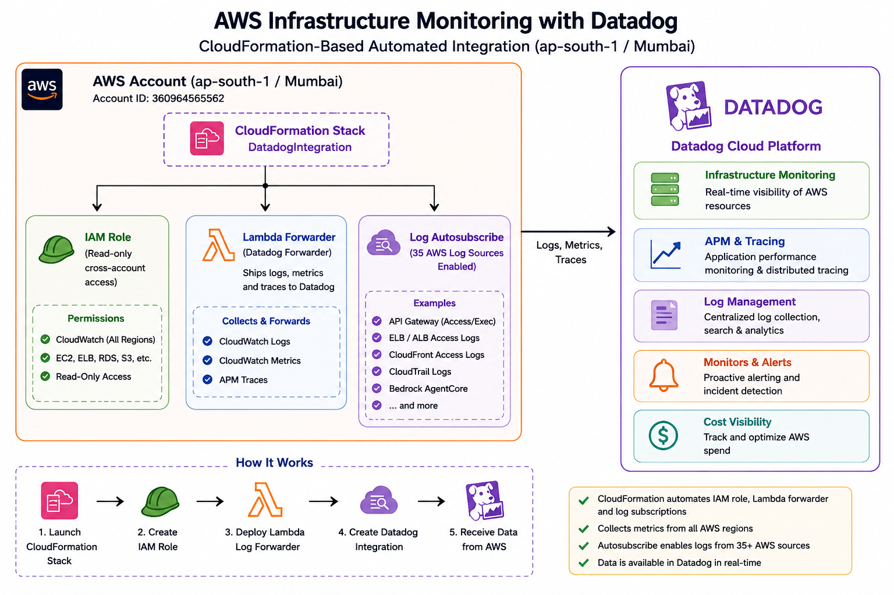
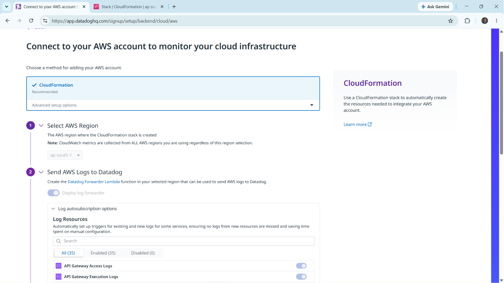
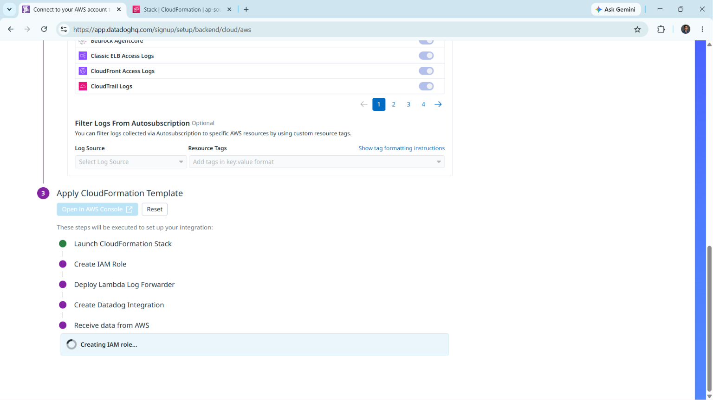
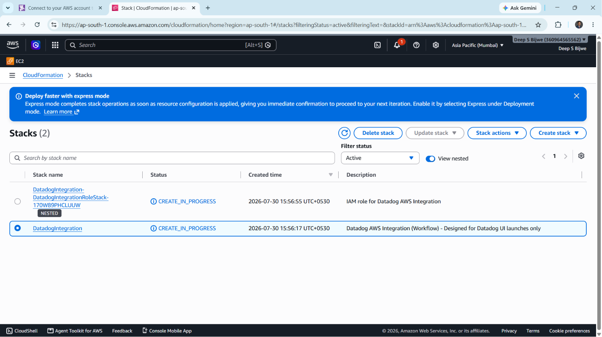
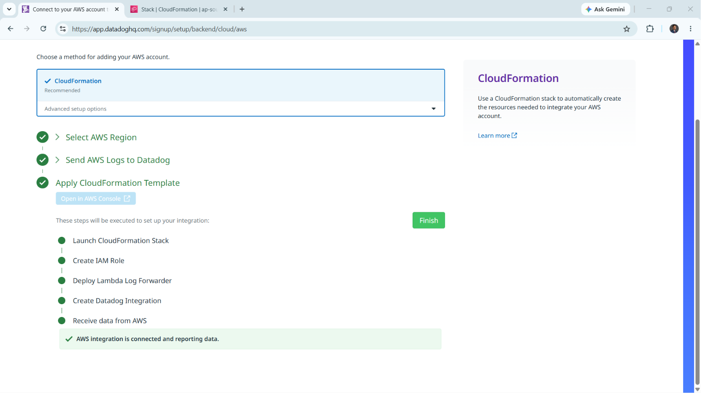
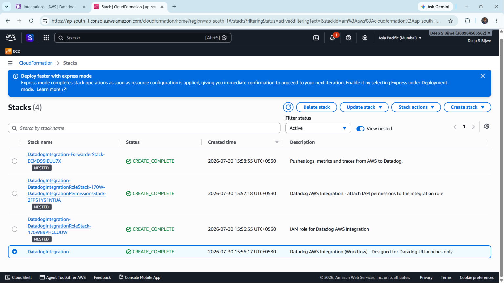
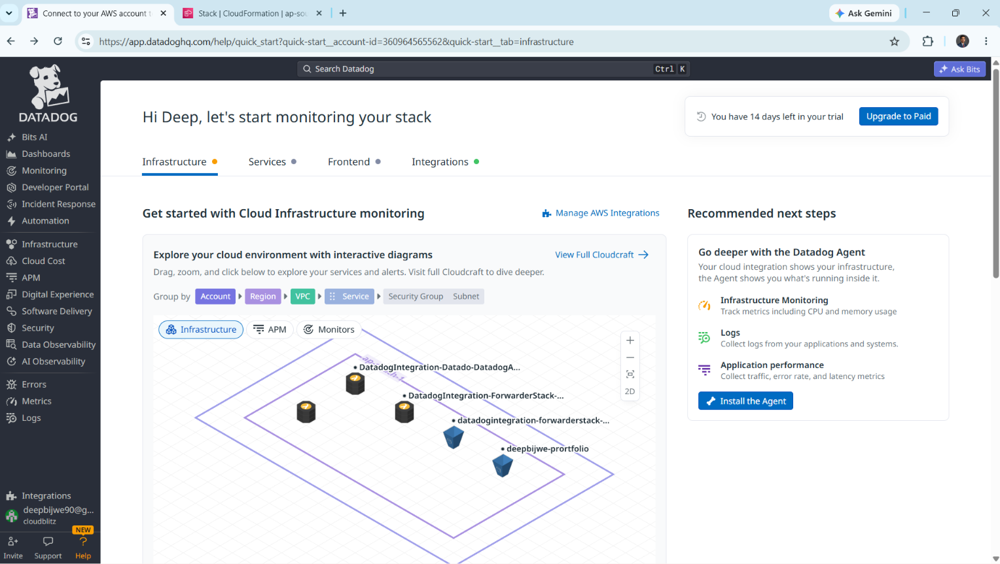

# AWS Infrastructure Monitoring with Datadog

Integrated my AWS account (Asia Pacific / Mumbai — `ap-south-1`) with Datadog using the **CloudFormation-based automated setup**, enabling real-time infrastructure monitoring, log collection, and observability across cloud resources — without manually creating IAM roles or Lambda forwarders.

## Architecture



CloudFormation provisions three things in the AWS account in one shot — a read-only IAM role, the Datadog Forwarder Lambda, and log autosubscription across 35+ AWS log sources — which together stream logs, metrics, and traces into Datadog's Infrastructure Monitoring, APM, Log Management, Monitors, and Cost Visibility products.

## Steps

### 1. Start the AWS Integration Setup in Datadog
Navigated to **Datadog → Integrations → AWS** (`app.datadoghq.com/signup/setup/backend/cloud/aws`) and chose the **CloudFormation (Recommended)** method over manual/advanced setup, since it automates IAM role creation and permission scoping.

### 2. Select AWS Region & Enable Log Forwarding
Set the target region to `ap-south-1` (Asia Pacific — Mumbai), where the CloudFormation stack and its resources would be created. Note: CloudWatch metrics are still collected from **all** AWS regions regardless of this selection — the region only determines where the integration's own resources live.

Turned on **Deploy log forwarder** to create the Datadog Forwarder Lambda function, then reviewed **Log Autosubscription** options — 35 log sources detected, all enabled by default (API Gateway Access/Execution Logs shown here).



### 3. Review Log Sources & Apply the CloudFormation Template
Scrolled through the full list of autosubscribed log sources (Bedrock AgentCore, Classic/CloudFront ELB Access Logs, CloudTrail Logs, and more — paginated across 4 pages) and left all of them enabled, skipping the optional resource-tag filtering.



Clicked **Open in AWS Console**, which launched the CloudFormation stack creation flow directly in the AWS account (`Deep S Bijwe`, account `360964565562`) in the Mumbai region. The stack executes 5 stages in sequence: Launch Stack → Create IAM Role → Deploy Lambda Log Forwarder → Create Datadog Integration → Receive data from AWS.

### 4. Monitor Stack Deployment in AWS Console
In the CloudFormation console, tracked the nested stacks as they moved through `CREATE_IN_PROGRESS`:
- `DatadogIntegration` — parent workflow stack (Datadog UI-launched only)
- `DatadogIntegration-DatadogIntegrationRoleStack-*` — nested IAM role stack



### 5. Confirm Integration in Datadog
Back in the Datadog setup wizard, all three steps (Select AWS Region, Send AWS Logs to Datadog, Apply CloudFormation Template) showed green checkmarks, with the confirmation: **"AWS integration is connected and reporting data."** Clicked **Finish** to complete setup.



### 6. Verify All Nested Stacks Completed
Back in the AWS Console, two additional nested stacks had appeared and all 4 stacks reached `CREATE_COMPLETE` within about 2 minutes:
- `DatadogIntegration-ForwarderStack-*` — pushes logs, metrics, and traces from AWS to Datadog
- `DatadogIntegration-DatadogIntegrationRoleStack-*-DatadogIntegrationPermissionsStack-*` — attaches IAM permissions to the integration role
- `DatadogIntegration-DatadogIntegrationRoleStack-*` — IAM role for the integration
- `DatadogIntegration` — parent workflow stack



### 7. Validate Infrastructure Visibility
Opened the Datadog **Infrastructure** tab and confirmed the account was live under a 14-day trial. The interactive Cloudcraft-style diagram rendered the newly discovered resources grouped by VPC:
- `DatadogIntegration-Datado-DatadogA...` (integration role/database icon)
- `DatadogIntegration-ForwarderStack-...` (Lambda forwarder)
- `datadogintegration-forwarderstack-...`
- `deepbijwe-portfolio` (existing service, now discovered automatically)



## Key Learnings
- The **CloudFormation method** is faster and less error-prone than manually creating IAM roles/policies for third-party monitoring tools — Datadog generates a scoped, least-privilege role automatically.
- **Log autosubscription** removes the need to manually configure CloudWatch subscription filters per log group per service — new resources are covered by default.
- Nested CloudFormation stacks let you track granular progress (role → permissions → forwarder) instead of a single opaque deployment.
- Datadog's Infrastructure map auto-discovers resources (e.g., existing S3/CloudFront-backed `deepbijwe-portfolio` site) purely from the IAM role's read access — no agent installation required for basic cloud infra visibility.

## Next Steps
- Install the **Datadog Agent** on EC2/EKS workloads for host-level metrics (CPU, memory) beyond what the API-based integration provides.
- Set up **Monitors** and alerting thresholds on key infrastructure metrics.
- Explore **APM** for the EKS-hosted flight reservation app and Jenkins-driven EC2 workloads already in the portfolio.

## Tech Stack
`AWS CloudFormation` · `IAM` · `AWS Lambda` · `CloudWatch Logs` · `Datadog (Infrastructure Monitoring, Log Management)`

## Repo Structure
```
├── README.md
└── screenshots/
    ├── architecture-diagram.png
    ├── 01-select-region-and-logs.png
    ├── 02-log-autosubscription.png
    ├── 03-cloudformation-stacks-in-progress.png
    ├── 04-integration-complete.png
    ├── 05-cloudformation-stacks-complete.png
    └── 06-datadog-infrastructure-map.png
```